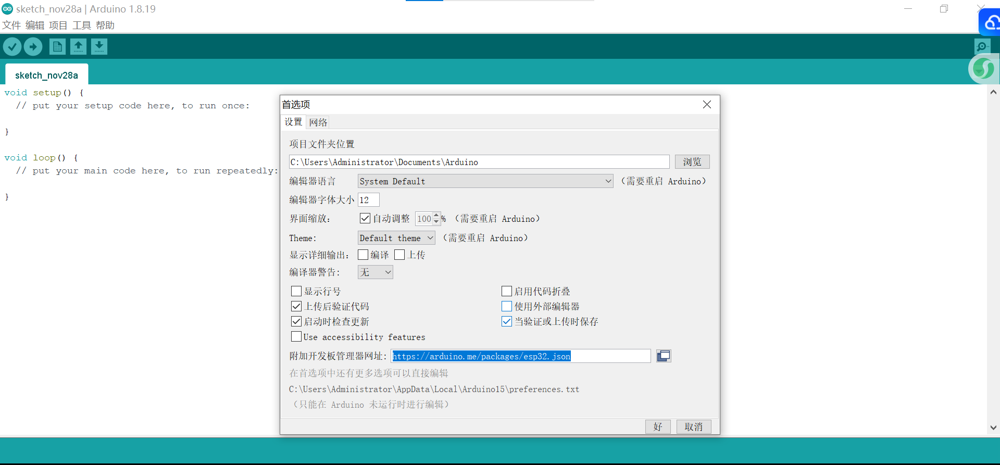
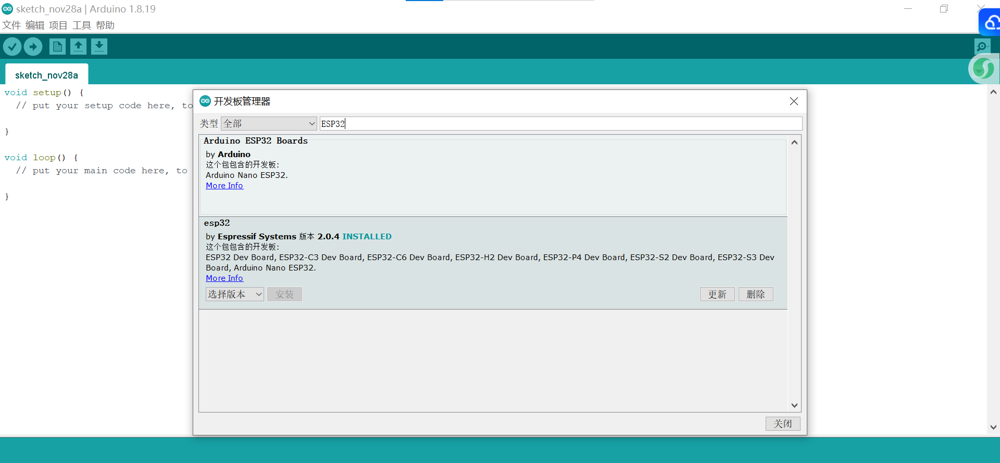
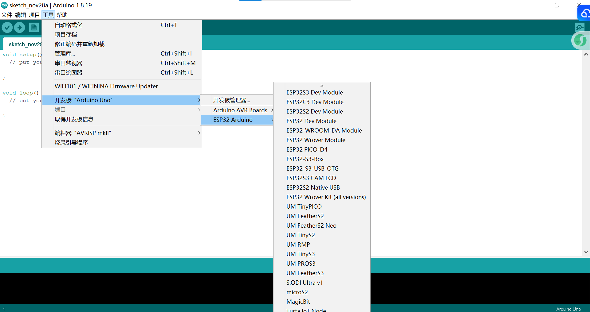
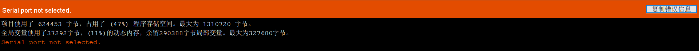
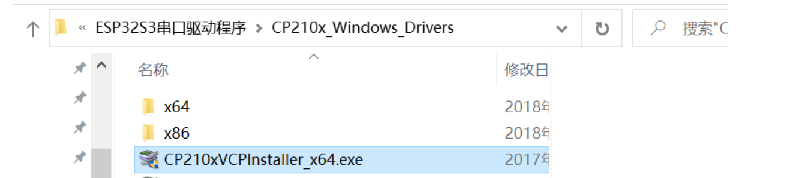
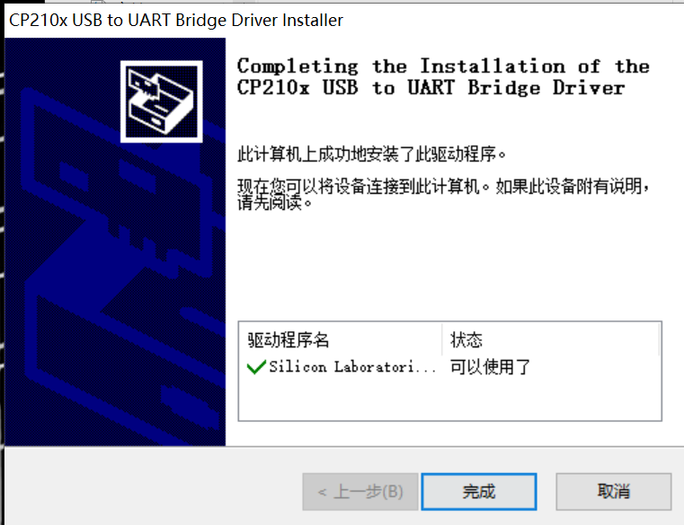
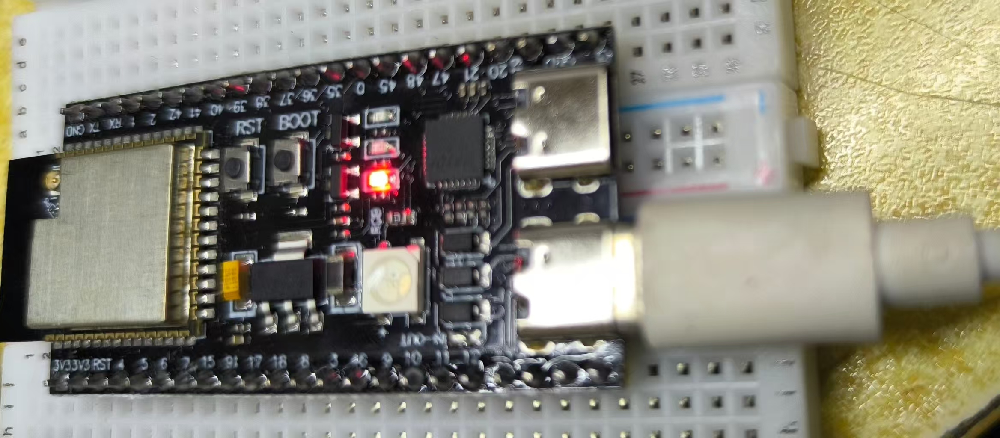
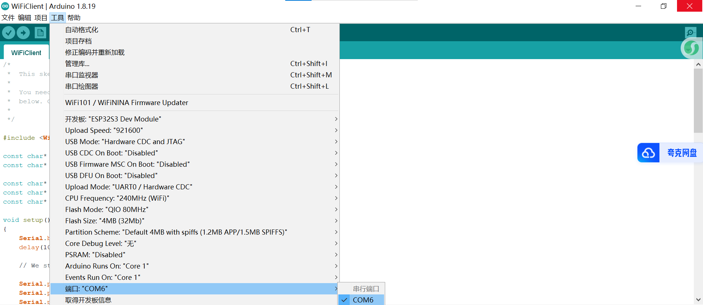
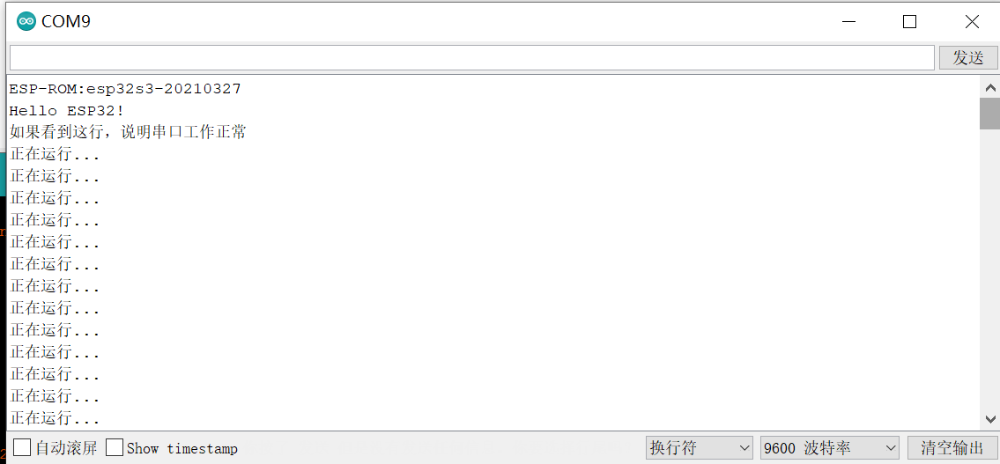

# 🎤 基于ESP32-S3的电子鹦鹉

> 这是一台能录能放的录音机！  
> 按下按钮，它就开始"偷听"；录完音，它还会嘀嘀咕咕地播放出来～  
> LED灯是它的"小情绪"——常亮表示在偷听，闪烁表示在自言自语！

---

## 📖 这玩意儿能干啥？

先上视频！！！https://www.bilibili.com/video/BV13MmwBkEQo/?spm_id_from=333.1387.homepage.video_card.click

这是一个基于 **ESP32-S3** 的录音/播放程序，使用：

- **INMP441** 数字麦克风（负责"听"）
- **MAX98357** 功放模块（负责"说"）
- 一个按钮（你按它，它就开始录音，过5秒它就会播放刚刚录下的内容）
- 一个LED（状态指示灯）

### ✨ 功能亮点

- ✅ 按下按钮 → 录音5秒（LED常亮）
- ✅ 录完自动播放（LED闪烁）
- ✅ 没录到声音？它会"叹气"（播放错误提示音）
- ✅ 音频质量分析（帮你找到最佳录音姿势）

---

## 🔧 你需要做啥？

### 环境搭建

首先下载ArduinoIDE，我用的是1.8.9版本：https://www.arduino.cc/en/software/，您也可以使用更新的版本。

安装结束后IDE里面安装一下ESP32 开发板的支持包：

打开IDE文件-首选项-附加开发板地址https://arduino.me/packages/esp32.json【这个是俺找的国内镜像源，相对比较快】



工具-开发板管理器-ESP32-安装



安装结束以后在工具-开发板里面可以看到ESP32 Arduino就成功了。



对了，记得下载串口驱动了！如果你没有下载后面运行程序会出现下面的报错：



打开 https://www.silabs.com/developers/usb-to-uart-bridge-vcp-drivers

点击下载 "CP210x Windows Drivers"

我是64位系统双击运行 CP210xVCPInstaller_x64.exe

双击安装即可





然后重启电脑，插好USB线



打开设备管理器可以看到


编译前要记得在Arduino IDE勾选一下端口



然后我的配置是这样的，仅供参考


如果您用USB线做虚拟串口，那个USB CDC On Boot记得打开！！！

> 这里USB CDC On Boot选项的作用在于：
>
> **启用后**：ESP32-S3 的 USB-C 口直接作为**串口调试端口**
> **禁用后**：USB-C 口只是**供电口**，需要通过额外的 UART 转USB芯片来调试

搞完以后要看看搞对没有，跑一个串口测试程序看看德性：

```
void setup() {
  Serial.begin(115200);//ESP32-S3使用USB CDC串口，必须使用115200波特率
  delay(3000);//ESP32-S3的USB串口需要时间建立连接
  Serial.println("Hello ESP32!");
  Serial.println("如果看到这行，说明串口工作正常");
}

void loop() {
  Serial.println("正在运行...");
  delay(1000);
}
```

如果正常输出是这样的



### 代码修改

**代码部分你只需要改引脚定义**，其他都不用动！

打开代码文件，找到 **`硬件引脚定义`** 这部分：

```cpp
// ========================================================
// 硬件引脚定义（这是你唯一需要修改的地方！）
// ========================================================

// 按钮和LED引脚
#define BUTTON_PIN     21    // 外部按钮信号线（你接哪个GPIO就改这里）
#define LED_PIN        11    // 录音状态指示灯（你接哪个GPIO就改这里）

// INMP441麦克风引脚
#define MIC_DATA_PIN   16    // INMP441 SD引脚（数据输出）
#define MIC_WS_PIN     17    // INMP441 WS引脚（字选择）
#define MIC_SCK_PIN    18    // INMP441 SCK引脚（时钟）

// MAX98357功放引脚
#define SPK_DATA_PIN   40    // MAX98357 DIN引脚（数据输入）
#define SPK_WS_PIN     42    // MAX98357 LRC引脚（帧时钟）
#define SPK_SCK_PIN    41    // MAX98357 BCK引脚（位时钟）
```

1. 看你把硬件接到了ESP32-S3的哪些GPIO引脚
2. 把上面的数字改成你实际连接的引脚号
3. 保存，上传，搞定！

**就是这么简单！** 其他所有参数（采样率、录音时间、音量等）都已经优化好了，**不需要你动**～

（当然如果你能改的效果更棒，当我没说哈哈）

---

## 📦 硬件连接表（照着重接就行）

| 组件              | 引脚   | ESP32-S3引脚 | 说明                 |
| ----------------- | ------ | ------------ | -------------------- |
| **INMP441麦克风** | VDD    | 3.3V         | 电源（必须3.3V！）   |
|                   | GND    | GND          | 地线                 |
|                   | SD     | GPIO16       | 数据输出             |
|                   | WS     | GPIO17       | 字选择               |
|                   | SCK    | GPIO18       | 时钟                 |
|                   | L/R    | GND          | 左声道选择（接地）   |
| **MAX98357功放**  | VIN    | 3.3V         | 电源                 |
|                   | GND    | GND          | 地线                 |
|                   | SD     | 3.3V         | 使能（接高电平常开） |
|                   | GAIN   | 悬空         | 15dB增益（悬空默认） |
|                   | DIN    | GPIO40       | 数据输入             |
|                   | BCK    | GPIO41       | 位时钟               |
|                   | LRC    | GPIO42       | 帧时钟               |
| **LED指示灯**     | 正极   | GPIO11       | 带电阻更好           |
|                   | 负极   | GND          | 地线                 |
| **外部按钮**      | 信号线 | GPIO21       | 高电平触发           |
|                   | VCC    | 3.3V         | 按钮电源             |
|                   | GND    | GND          | 按钮地线             |

> ⚠️ **注意**：如果你改了引脚定义，上面表格里的GPIO号也要跟着改哦！

---

## 🚀 怎么玩？

1. **接线** → 按上面的表格把硬件连好
2. **改引脚** → 把你实际用的GPIO号填到代码里
3. **上传代码** → 用Arduino IDE或PlatformIO
4. **按按钮** → 对着麦克风说话
5. **听回放** → 它会自动播放你刚才说的

### 🔍 小贴士

- 离麦克风 **10-30cm** 效果最好
- 录音时 **LED常亮**，播放时 **LED闪烁**
- 打开串口监视器（115200）可以看到**音频质量分析**

---

## 📜 开源协议

MIT License —— 随便玩，随便改，随便卖，出了问题别找我（但可以来GitHub提issue，我尽量救你）

---

## 🌟 最后一句

如果你觉得这玩意儿有趣，给个⭐呗～  
如果你觉得这玩意儿就是坨垃圾...那就当你没看见这句话！

